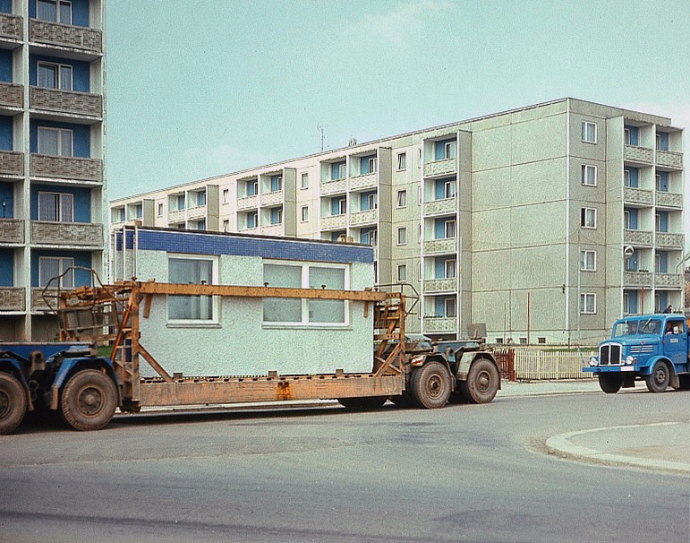
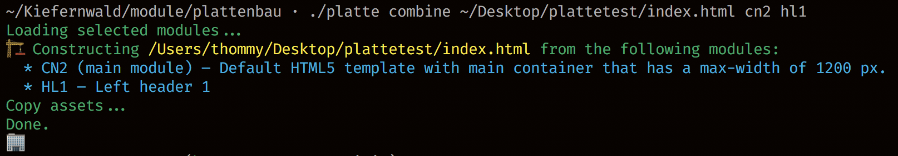

# Platte

*(Transport of Plattenbau parts in Karl-Marx-Stadt, GDR, 1975 [CC BY-SA 3.0 de](https://creativecommons.org/licenses/by-sa/3.0/de/deed.en) Deutsche Fotothek)*

Platte is a small command line tool that combines static HTML pages from modules. It is named after the german word [Plattenbau](https://en.wikipedia.org/wiki/Plattenbau) which is a way of building houses based on pre-fabricated parts.

## Installation

Platte requires ruby. To install, run:

`bundle install`

## Usage

The main script to be used is `platte` in the main folder. It has a single command, called `combine` which lets you combine a main-module (usually the surrounding HTML structure with placeholders for resources) and other modules.

All modules you define must be placed in the `modules` folder. Main modules names end with `.main`, other modules names end with `.module`.

## Module structure

TODO More docs

## Contributing

Bug reports and pull requests are welcome on GitHub at https://github.com/kiefernwald/platte.
